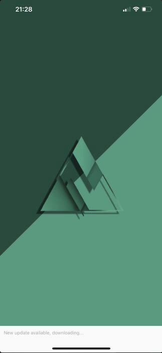
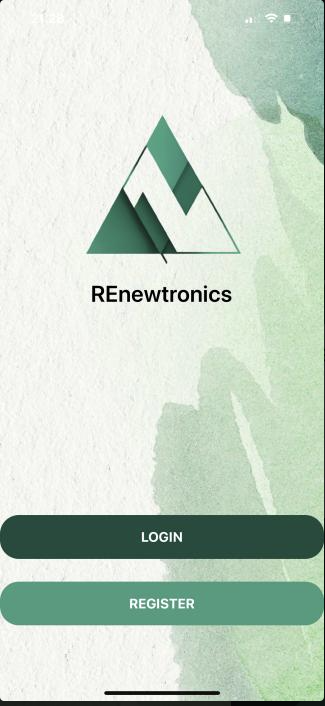
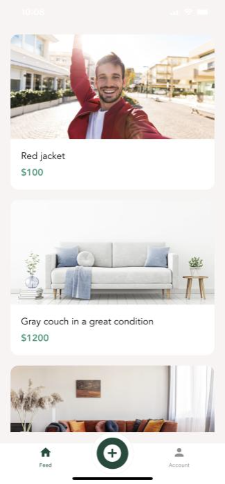
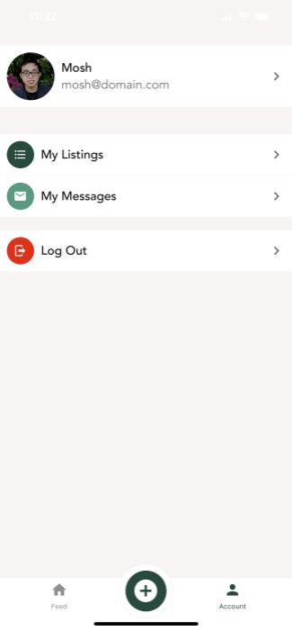
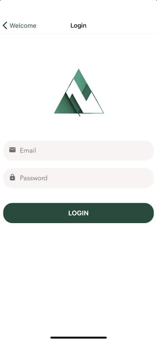
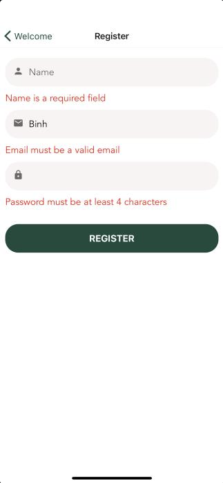
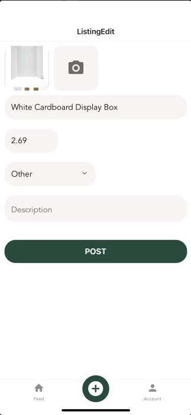
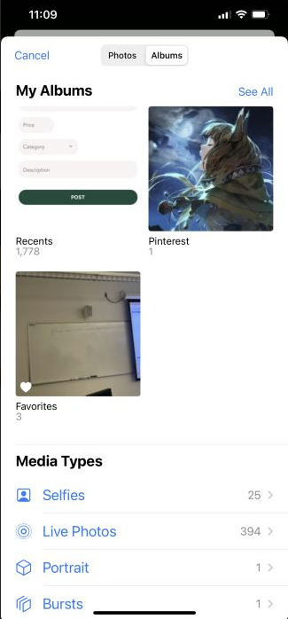
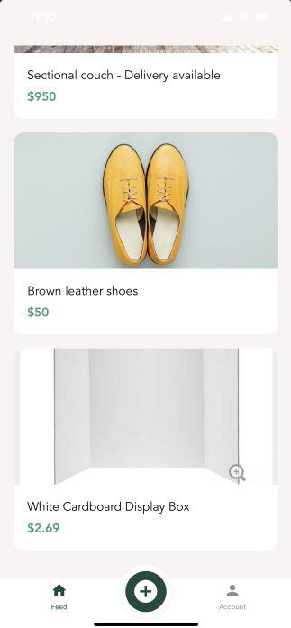

# REnewtronics

# Authors/Developers: Binh Pham, Alberto Acosta, Hung Nguyen.

  
 

# About:
This is a matching app where people can do online trading or buying second-hand items from other people. In other words, this app purpose is similar to OfferUp 
and CragList where users can post their no-longer needed items online for sale and buy second-hands items from other users at a cheaper price. The context purpose of 
the app is to be submit as a minimum viable product for school Social Venture Competition. This is our second attemps at designing apps from React Native. 
This app took significant inspirations from Mosh's React Native course online because we expanded our designing knowledgde based on it.

# Social Media:
Showcases and work progress contents are posted on Instagram, please check out at:
[Link will be updated here later]

# Software:

Visual Studio Code, Expo Go, Postman.

# Functionality:

 

1. Signing in (can use FaceID) correctly will pass encrypted access token to ensure the login process. Implementing Account Registration with specfic condition in each textInput field using Yup.
3. Implementing AsyncStorage and SecureStorage to cache data in the app. More specifically, even when there is no Internet connection, the app will still restore all previous data from database. Additionally, the app will memorise any state changes and perform necessary actions when there is Internet connection again. 
4. Simulating sending notification messages toward other users. On receiving such messages, one tap on one of those and the app will direct to the message tab. 

  

5. The capability of posting a new item with these respective field, such as title, price, category, description. Each of these field input all has their respective condition checks and customizations like numpab-only-keyboard and other features. Furthermore, there is a option to choose and upload images from the camera roll. All these information will be recorded on the Node.js database and shown in the list after reload.
6. Using a Node.js backend to record all the necessary information.
7. Using Lottie Animation to increase the liveliness of the app during fetching data or uploading data process.
8. Thoughtfully design different modules of components, api, hooks, assets, etc. This is ensure seperation of concerns. Specifically, we build and use a lots of custom hooks, text, itemPicker, etc. 

# API Reference Installtion:
[Will add it later]

# Improvements That Could Be Made:

* Make Statusbar become more visible depending on the background color.
* Learn Node.js or SQLite more to implement our own customizable back-end, especially implementing our message system or chat log.
* Using API Reference to pinpoint a map location of the user.
* Research and update some old function that will soon to be deprecated.
* Fixing some Keyboard view pop-up in some places.

# Credit:

- **Binh: Lead Developer/Programmer.**
- **Acosta: Developer, UI Designer.**
- **Hung: UX/UI Designer.**
- **The Back-end that we chose was taken directly from Mosh's Advanced React Native online course:**
**[Code With Mosh](https://codewithmosh.com/p/the-ultimate-react-native-course)**

